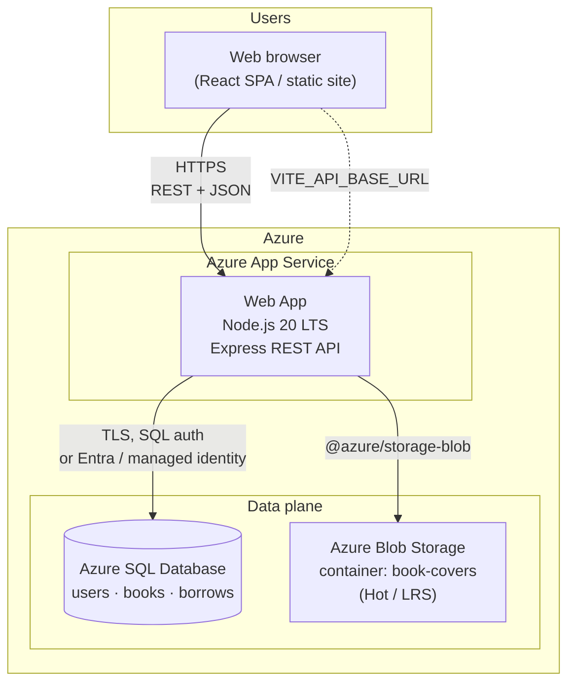
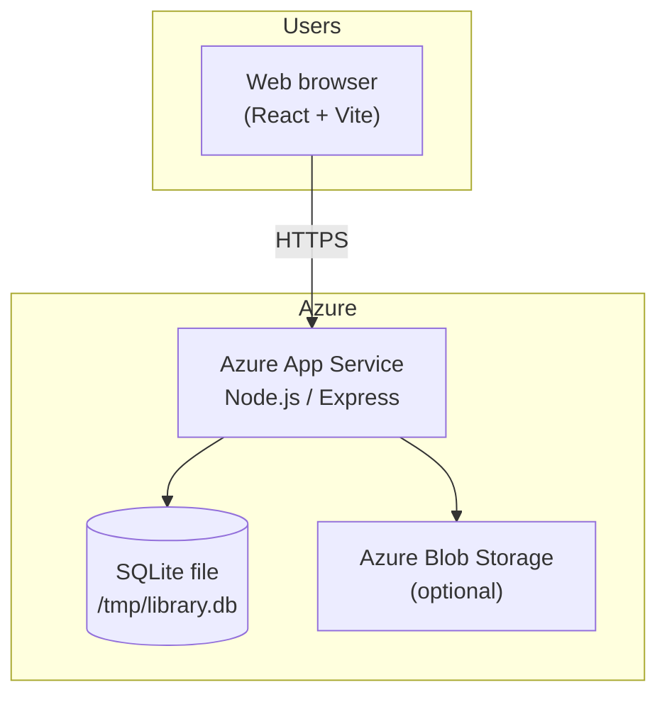
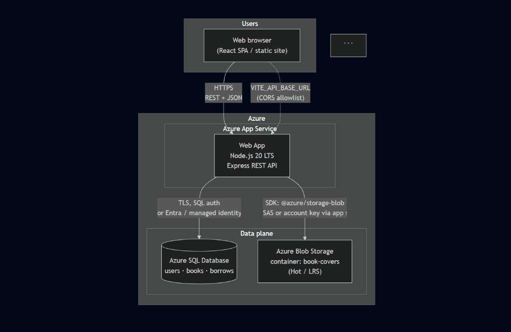
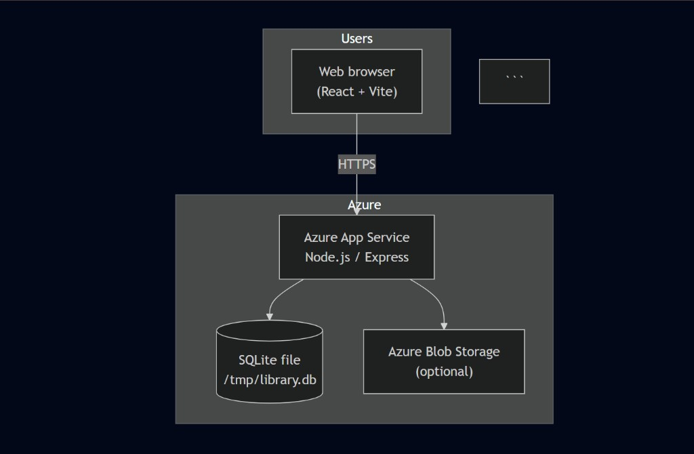

# Online Library Management System (Libra)

**Status:** Feature-complete for the capstone scope — user auth (reader + staff), catalog with availability, borrow/return with due dates, admin catalog management, optional Azure Blob covers, JWT + bcrypt, and Azure-oriented documentation with a **Pricing Calculator** cost workflow.

---

## What’s included

| Area | Details |
|------|---------|
| **User management** | Register, login, account page; separate **`/admin/login`** for staff; roles enforced in UI and API. |
| **Book catalog** | Titles, authors, genres, availability; filters on the catalog page. |
| **Borrowing** | Borrow (due date), return, **My** borrows; API-backed when the server is running. |
| **Storage** | SQLite locally / under App Service; optional **Azure Blob** for cover uploads (`AZURE_STORAGE_CONNECTION_STRING`). |
| **Docs** | [docs/COURSE-SUBMISSION.md](./docs/COURSE-SUBMISSION.md), [docs/DELIVERABLES-STATUS.md](./docs/DELIVERABLES-STATUS.md), [docs/ARCHITECTURE.md](./docs/ARCHITECTURE.md) |

---

## Architecture (visual)

**Mermaid** (renders on GitHub) and **PNG exports** (same diagrams — good for PDFs / slides) live below.

### Target on Azure (SQL + Blob)



### Current repo deployment (SQLite + optional Blob)



### Exported diagrams (PNG)





---

## Cost estimate snapshot (example)

Illustrative line items from an **Azure Pricing Calculator** export (Central India where noted; adjust in your own Excel export):

| Service | Example monthly (USD) |
|---------|------------------------:|
| App Service (F1 Linux, Central India) | 0.00 |
| Azure SQL Database (example config) | 159.69 |
| Storage Accounts — Blob (example) | 1.15 |
| **Example total** | **~160.84** |

Generate your own file at the [Azure Pricing Calculator](https://azure.microsoft.com/pricing/calculator/) and keep the Excel/PDF with your submission.

**Optional:** add a cost spreadsheet screenshot as [`docs/screenshots/cost-estimate-excel.png`](./docs/screenshots/cost-estimate-excel.png) and embed it here with  
``  
if you want the README to show the calculator export image as well.

---

## Tech stack

- **Frontend:** React, TypeScript, Vite (`src/`)
- **Backend:** Node.js 20, Express, SQLite (`better-sqlite3`) in `server/`
- **Azure:** App Service Linux, Node startup `npm start` — see [`server/README.md`](./server/README.md) and [`.github/workflows/deploy.yml`](./.github/workflows/deploy.yml)

---

## Run locally

```bash
npm install
npm start            # API — http://localhost:8000 (separate terminal)
npm run dev          # UI — http://localhost:5173
```

- Copy [`.env.example`](./.env.example) → **`.env.local`**. For local dev with the Vite proxy, you can leave `VITE_API_BASE_URL` empty; see `.env.example` for remote API and `VITE_FORCE_REMOTE_API`.
- Copy **`.env`** for API secrets when running `npm start` (`JWT_SECRET`, optional Blob connection string).

**Dev admin (API seed):** after a successful `npm start`, staff login at `/admin/login` with **`admin@libra.local`** / **`LibraAdmin123!`** unless overridden — see `server/README.md`.

---

## API quick reference

| Endpoint | Purpose |
|----------|---------|
| `POST /auth/register`, `POST /auth/login` | Auth |
| `GET /auth/me` | Current user |
| `GET /books`, `GET /books/:id` | Catalog |
| `POST /borrow/:bookId`, `POST /return/:bookId` | Loans |
| `GET /me/borrows` | Active borrows |
| `GET /health`, `GET /docs` | Health + Swagger |

---

## Repository layout

```
src/           # React app
server/        # Express API + SQLite + optional Blob
docs/          # Course / Azure submission notes + screenshots folder
.github/       # Deploy workflow
```

---

## License

Project coursework — use and adapt per your institution’s rules.
