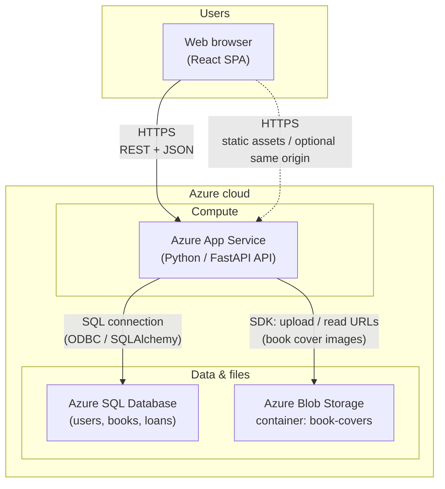

# Online Library Management System — Azure Architecture

This document describes how the main components connect when the system is deployed on Microsoft Azure.

## High-level architecture diagram

## What each part does

| Component | Role |
|-----------|------|
| **Web browser** | Runs the React UI: login, catalog, borrow/return, account. |
| **Azure App Service** | Hosts the FastAPI backend (`uvicorn` / gunicorn). Exposes `/auth`, `/books`, `/borrow`, `/return`, `/upload`, etc. |
| **Azure SQL Database** | Stores relational data: users, books, borrow records, availability counts. |
| **Azure Blob Storage** | Stores binary files for book cover images; the API saves metadata and public or SAS URLs in the database. |

## Request flow (example)

1. User opens the site and calls the API over **HTTPS** (with optional **CORS** from your front-end origin).
2. **Login / JWT**: App Service validates credentials and issues tokens; secrets stay in **App Service configuration** (not in code).
3. **Catalog & loans**: API reads/writes **Azure SQL** for books and loan rows.
4. **Covers**: Admin upload goes to **Blob**; the API stores the returned **URL** on the book row in SQL.

## Optional: where the React app lives

You can host the built front end in several ways; two common patterns:

- **Same App Service**: Serve the API under `/api` and static files from the same app, or use two App Service apps (UI + API).
- **Azure Static Web Apps** or **Storage static website** + **App Service** for API only (CORS must allow the UI origin).

This does not change the diagram above: the browser still talks HTTPS to App Service for APIs, and App Service talks to SQL and Blob.

## Legend

- **Solid arrows**: Primary data paths used in this project’s backend.
- **Dotted arrow**: Front-end hosting options that may share the same hostname or a different URL (configure `VITE_API_BASE_URL` / CORS accordingly).
