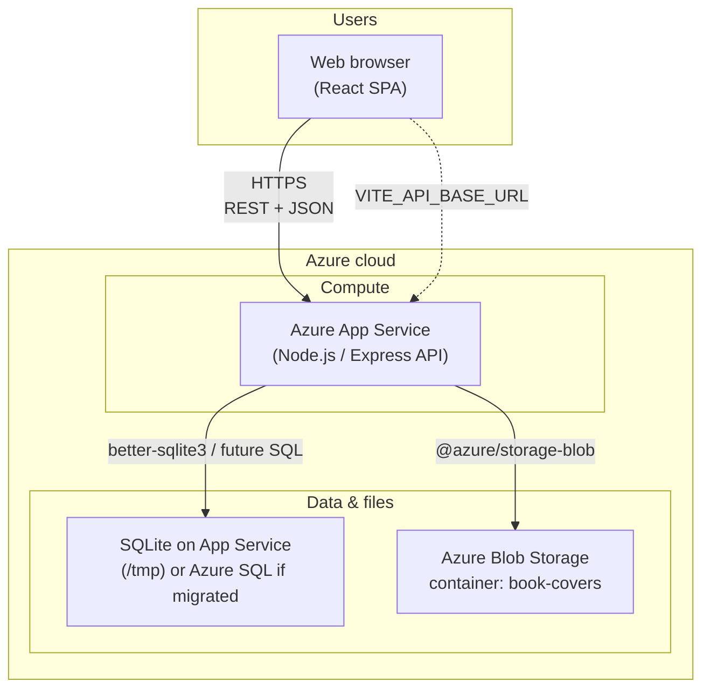

# Online Library Management System — Azure Architecture

## High-level architecture diagram

## What each part does

| Component | Role |
|-----------|------|
| **Web browser** | React UI: login, catalog, borrow/return, admin. |
| **Azure App Service** | Hosts Express API: `/auth`, `/books`, `/borrow`, `/return`, `/me/borrows`, `/upload`, `/docs` (Swagger UI). |
| **SQLite** | Default embedded DB (`/tmp/library.db` on Azure). |
| **Azure Blob** | Optional cover uploads via `AZURE_STORAGE_CONNECTION_STRING`. |

## Optional: where the React app lives

Same patterns as before: Static Web Apps, Storage static site, or same origin — set **CORS** and **`VITE_API_BASE_URL`**.
