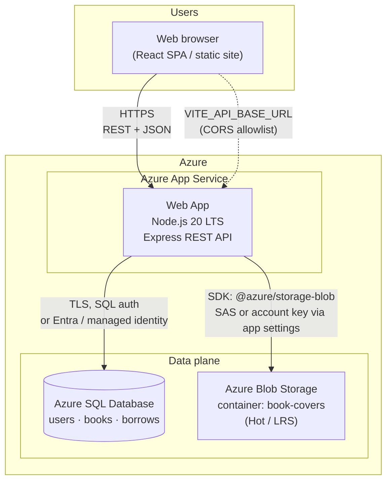
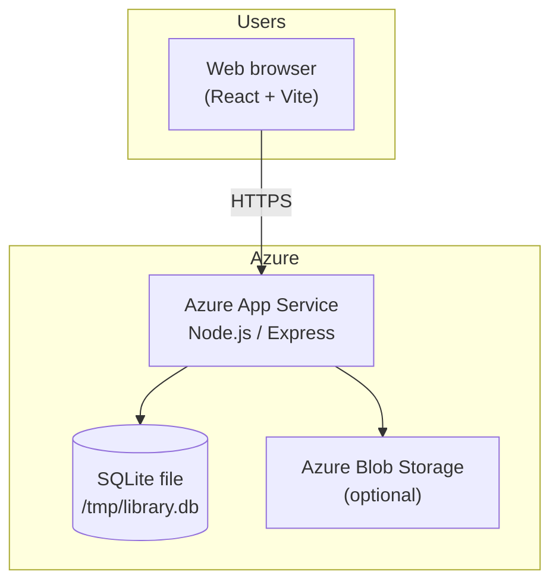

# Online Library Management System — Azure Architecture

## Diagram 1 — Assignment target (recommended production shape)

| Component | Responsibility |
|-----------|----------------|
| **Azure App Service** | Runs the Node/Express API (`npm start`), JWT auth, business logic, Swagger at `/docs`. |
| **Azure SQL Database** | Relational store for users, books, borrow rows; backups per SQL SKU. |
| **Azure Blob Storage** | Book cover images; URLs persisted in the database. |

**PNG export (same as diagram 1):**  

---

## Diagram 2 — This repository (current deployment pattern)

**PNG export (same as diagram 2):**  

To align runtime with Diagram 1, replace `server/db.js` with an Azure SQL client and point connection settings at your database — see [`COURSE-SUBMISSION.md`](./COURSE-SUBMISSION.md) section 2.2.

---

## Where the React app runs

Typical patterns: **Azure Static Web Apps**, **Blob static website + CDN**, or any host with **`VITE_API_BASE_URL`** pointing at the App Service API and **CORS** configured (`CORS_ORIGINS`).
