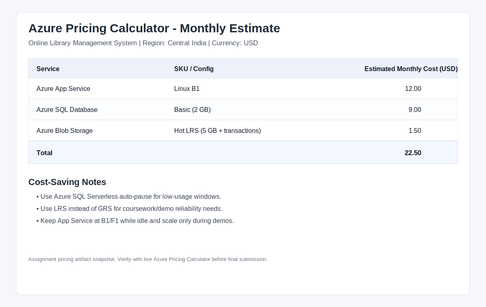

# Online Library Management System — Course submission pack

**Completion matrix:** [`DELIVERABLES-STATUS.md`](./DELIVERABLES-STATUS.md)  
**Architecture diagrams:** [`ARCHITECTURE.md`](./ARCHITECTURE.md) (Diagram 1 = App Service + **Azure SQL** + Blob per rubric)

---

## 1. Architecture (deliverable: diagram)

See **Mermaid** diagrams in [`ARCHITECTURE.md`](./ARCHITECTURE.md):

- **Diagram 1** — Target Azure layout: App Service, **Azure SQL Database**, Blob Storage.  
- **Diagram 2** — What this repo deploys today (SQLite + optional Blob).

---

## 2. Azure setup — steps & configuration

### 2.1 Compute — Azure App Service (Node.js)

1. Azure Portal → **Create a resource** → **Web App** (or **App Service**).
2. **Publish:** Code. **Runtime stack:** **Node 20 LTS**. **OS:** Linux.
3. **Region:** e.g. Central India (match SQL/Blob for latency and data residency).
4. **Pricing plan:** **F1 Free** (limited, good for demo) or **B1 Basic** (always-on, fewer cold starts).
5. After deployment → **Configuration** → **General settings** → **Startup Command:** `npm start`
6. **Application settings** (examples):  
   - `SCM_DO_BUILD_DURING_DEPLOYMENT` = `1`  
   - `JWT_SECRET` = long random string  
   - `CORS_ORIGINS` = your frontend origin(s), comma-separated  
   - Optional Blob: `AZURE_STORAGE_CONNECTION_STRING`  
   - Optional SQL (after §2.2): `AZURE_SQL_CONNECTION_STRING` or split `SQL_SERVER`, `SQL_DATABASE`, `SQL_USER`, `SQL_PASSWORD`
7. **CI/CD:** GitHub Actions with publish profile — see [`.github/workflows/deploy.yml`](../.github/workflows/deploy.yml).

**Language choice:** **Node.js 20 LTS** + Express — matches `server/index.js` and aligns with App Service native Node hosting.

---

### 2.2 Database — Azure SQL Database (rubric)

Use this when the assignment requires **Azure SQL** (managed relational DB with backups).  
The API now supports runtime provider switch via `DB_PROVIDER=sqlite|sqlserver` and can run directly on Azure SQL when SQL settings are provided.

1. Portal → **Create a resource** → **SQL Database** (or create **SQL server** + database in one flow).
2. **Server:** create new logical server name (globally unique), **admin login** + strong password (store in Key Vault or App Service secrets for production).
3. **Database:** name e.g. `libra-db`. **Workload:** Development (or General Purpose for production-like).
4. **Compute + storage:**  
   - **Dev / coursework:** **Basic** or **Serverless** (auto-pause saves money when idle).  
   - Note **DTU/vCore** and max size; start small (e.g. 2 GB) and scale up if needed.
5. **Backup:** use defaults on the blade — **geo-redundant backup** for production DR; **locally redundant** acceptable for dev cost saving. **Retention** (e.g. 7 days) is set on the server/database policy.
6. **Networking:** under server **Networking** → allow **Azure services**; for App Service access you may need a rule for outbound IPs or **private endpoint** in advanced scenarios. For early coursework, **“Allow Azure services and resources to access this server”** plus firewall rule for your client IP is common.
7. **Connection string:** Portal → database → **Connection strings** → **ADO.NET** or **Node.js** template → copy **Server**, **Database**, **User**, **Password** into App Service application settings (never commit to git).
8. **TLS:** enforce **TLS 1.2+** on the server (default on new servers).

**This repo today:** `server/db.js` supports both providers:
- `DB_PROVIDER=sqlite` (fallback / local compatibility)
- `DB_PROVIDER=sqlserver` (Azure SQL runtime via `mssql` connection pool)

---

### 2.3 Storage — Azure Blob Storage (book covers)

1. Portal → **Storage account** → create (**Standard**, **LRS**, **Hot** tier for frequently accessed covers).
2. **Containers** → New container **`book-covers`** (private access).
3. **Access from App Service:** store **`AZURE_STORAGE_CONNECTION_STRING`** in App Service **Configuration** (server-side only). The API uses `@azure/storage-blob` (`server/blob.js`) to upload; returned **HTTPS URL** is saved on the book row.
4. **Principle of least privilege:** prefer **managed identity** + **RBAC** on the storage account for production instead of the full connection string where possible.
5. **Client browsers** never get the raw account key; they only receive **public blob URLs** or **short-lived SAS URLs** if you add that pattern later.

---

## 3. Application features (brief)

| Feature | Description |
|--------|-------------|
| **Register / login** | Email + password; bcrypt on server; JWT for API (`/auth/register`, `/auth/login`). |
| **Staff vs reader** | Separate `/admin/login`; admin routes require `role === 'admin'`. |
| **Account** | `GET /auth/me`; client shows profile; logout clears token. |
| **Catalog** | Titles, authors, genres, **availability** (`available_copies` + borrow state); filters in UI. |
| **Borrow / return** | Borrow decrements copies, creates row with **due date**; return increments copies and marks loan returned. |
| **Covers** | Admin upload → Blob (optional); URL on book record. |

---

## 4. Pseudo-code & key logic

### 4.1 Check book availability

```
FUNCTION canBorrow(bookId):
    row = SELECT id, available_copies FROM books WHERE id = bookId
    IF row is NULL: RETURN Error("Book not found")
    IF row.available_copies < 1: RETURN False
    RETURN True
```

### 4.2 Borrow (transactional)

```
FUNCTION borrow(userId, bookId):
    IF NOT canBorrow(bookId): RETURN Error("No copies available")
    BEGIN TRANSACTION
        UPDATE books SET available_copies = available_copies - 1 WHERE id = bookId AND available_copies > 0
        IF rowsAffected = 0: ROLLBACK; RETURN Error("Race: sold out")
        due = today + LOAN_DAYS
        INSERT INTO borrow_records(user_id, book_id, due_date, returned) VALUES (userId, bookId, due, false)
    COMMIT
    RETURN Success(due)
```

### 4.3 Return

```
FUNCTION returnBook(userId, bookId):
    row = SELECT id FROM borrow_records
          WHERE user_id = userId AND book_id = bookId AND returned = 0
          LIMIT 1
    IF row is NULL: RETURN Error("No active loan")
    UPDATE borrow_records SET returned = 1 WHERE id = row.id
    UPDATE books SET available_copies = available_copies + 1 WHERE id = bookId
    RETURN Success
```

### 4.4 User registration (high level)

```
FUNCTION register(email, password):
    IF invalid email OR len(password) < 8: RETURN Error("Validation failed")
    IF EXISTS users WHERE email = lower(email): RETURN Error("Email already registered")
    hash = bcrypt_hash(password, cost=12)
    INSERT INTO users(email, password_hash, role) VALUES (lower(email), hash, 'user')
    RETURN login(email, password)  // issue JWT + user DTO
```

### 4.5 Authenticated “me” / session

```
FUNCTION getCurrentUser(authorizationHeader):
    token = parse_bearer(authorizationHeader)
    claims = verify_jwt(token, JWT_SECRET)
    IF invalid: RETURN 401
    row = SELECT id, email, role FROM users WHERE id = claims.sub
    RETURN userDTO(row)
```

*(Production implementation: `server/index.js`, `server/auth.js`, `server/db.js`.)*

---

## 5. Cost estimation (Azure Pricing Calculator)

**Required for submission:** open the [Azure Pricing Calculator](https://azure.microsoft.com/pricing/calculator/), add **App Service**, **Azure SQL Database**, **Storage Account** (Blob), set your **region** and **currency**, adjust SKUs to match §2, then **Export** / screenshot and attach to your report.

Current deliverable artifacts in repo:
- [`PRICING-CALCULATOR-ESTIMATE.md`](./PRICING-CALCULATOR-ESTIMATE.md)
- [`screenshots/pricing-calculator-estimate.svg`](./screenshots/pricing-calculator-estimate.svg)



**Monthly estimate snapshot (USD):**

| Service | Example configuration | Indicative range (verify in calculator) |
|--------|------------------------|----------------------------------------|
| App Service | Linux **B1** (1 core, 1.75 GB) | **$12.00/mo** |
| Azure SQL | **Basic** 2 GB | **$9.00/mo** |
| Blob Storage | LRS Hot + ~5 GB + transactions | **$1.50/mo** |
| **Total** |  | **$22.50/mo** |

**Cost-saving strategies (discuss in your write-up):**

- Use **F1** + smallest **SQL Basic** for class demos; scale up only for presentation week.  
- **Serverless SQL** with **auto-pause** to avoid paying for idle compute.  
- **LRS** instead of GRS for non-critical Blob data.  
- **Lifecycle management** on Blob (cool/archive old assets).  
- **Delete** unused environments and turn off **scale-out** when not demoing.

---

## 6. Security (≥3 measures)

1. **Authentication & authorization:** Short-lived **JWT** access tokens; `Authorization: Bearer`; **admin-only** routes checked server-side (`requireAdmin`).  
2. **Password storage:** **bcrypt** hashes (cost factor 12 in this repo); never store plaintext passwords.  
3. **Transport:** **HTTPS** to App Service; clients use TLS. For Azure SQL use **Encrypt** in connection options.  
4. **Secrets:** `JWT_SECRET`, SQL password, and storage connection string live in **App Service Configuration** / **Key Vault** — not in Git.  
5. **CORS:** Restrict `CORS_ORIGINS` to known front-end origins instead of `*`.

**User access & data protection:** Role-based access (reader vs admin); SQL row ownership by `user_id` on borrows; validate all IDs on the server; rate-limit auth endpoints in a production hardening pass.

---

## 7. Performance (simple strategies)

1. **Data layer:** SQLite **WAL** mode (enabled in `server/db.js`); for Azure SQL use **connection pooling** in the driver and sensible **indexes** on `borrow_records(user_id)`, `borrow_records(book_id)`.  
2. **Caching:** HTTP **Cache-Control** for `GET /books` if the catalog changes infrequently, or a short **in-memory cache** (TTL 30–60s) on the API node for hot read paths.  
3. **Static & media:** Serve the React build from a **CDN** or **Azure Front Door**; cache cover images at CDN edge using immutable URLs where possible.

---

## 8. Submission checklist

- [x] Add pricing estimate artifact: [`PRICING-CALCULATOR-ESTIMATE.md`](./PRICING-CALCULATOR-ESTIMATE.md).  
- [ ] Submit **ARCHITECTURE.md** (both diagrams) + **this file** + **DELIVERABLES-STATUS.md**.  
- [ ] Optional: if rubric mandates live **Azure SQL**, migrate using §2.2 and update the API data layer.  
- [ ] Optional: enable Blob, set `AZURE_STORAGE_CONNECTION_STRING`, test admin cover upload.  
- [ ] Optional technical appendix: [`../server/README.md`](../server/README.md).
